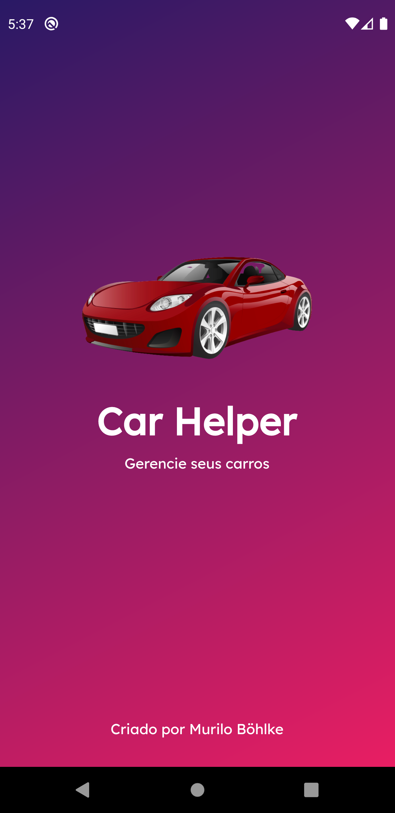
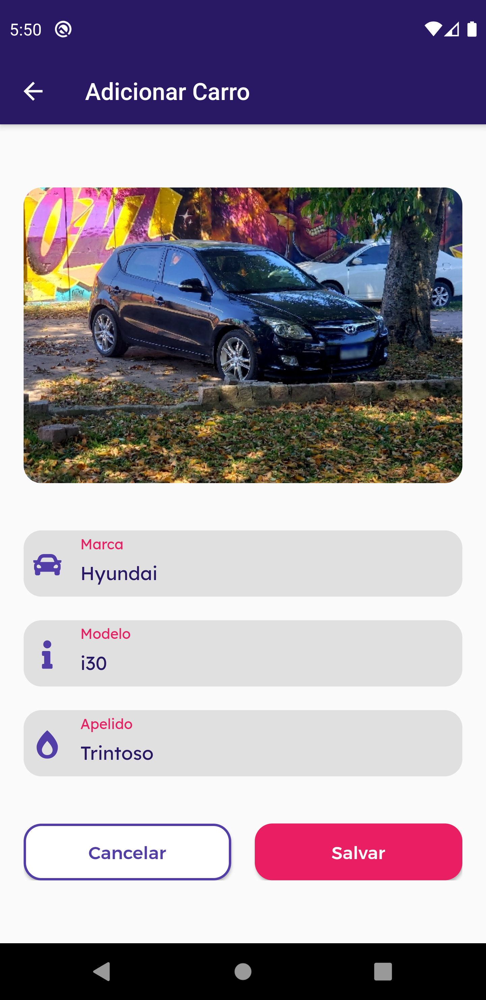
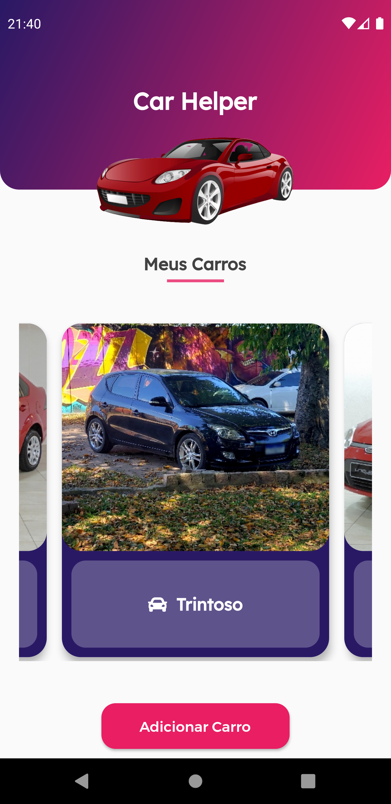
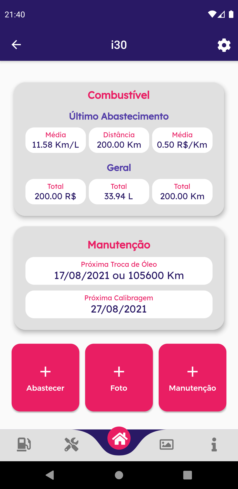
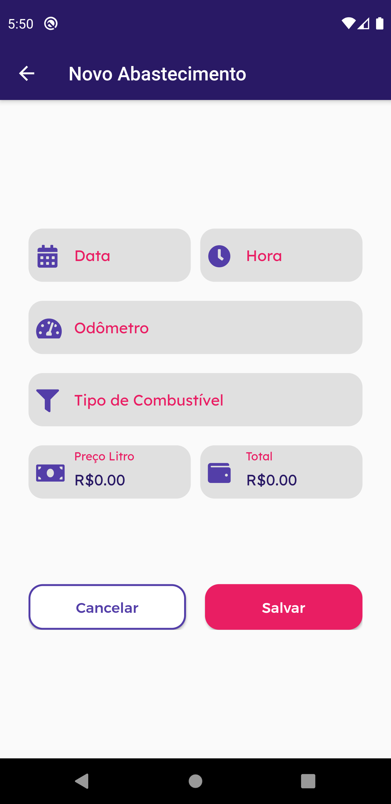
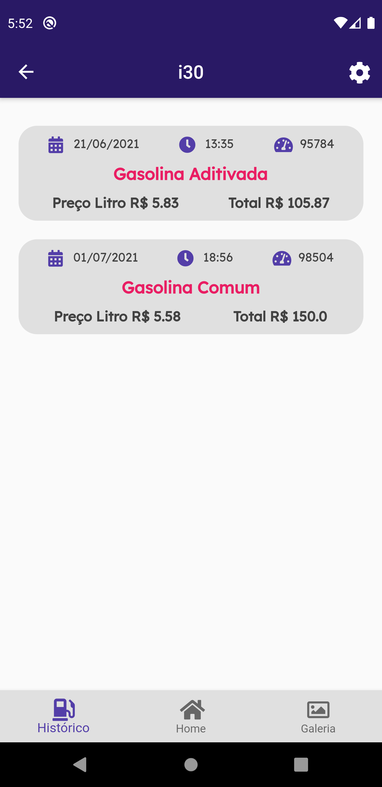
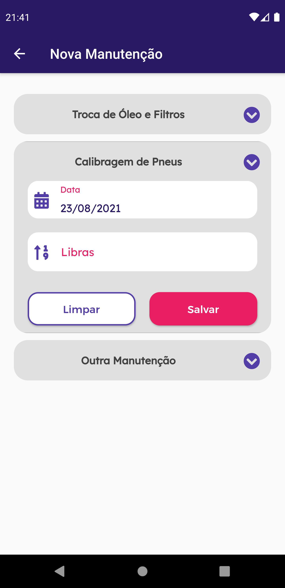
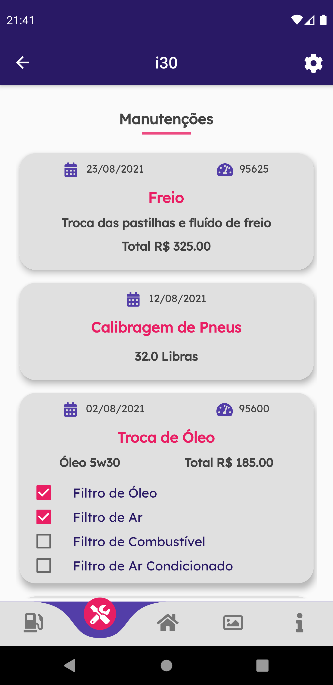

# Car Helper

# Sobre o Projeto
O Car Helper é um aplicativo desenvolvido em Flutter para gerenciar carros. Dada a necessidade de se ter um controle sobre os reabastecimentos, a manutenção e até as fotos tiradas do meu carro, tive a ideia de desenvolver um app completamente personalizável, fazendo tudo como eu acho que me atende melhor. É um projeto único e exclusivo por se tratar de uma ideia minha.

# Layout

        

# Objetivo

O objetivo do desenvolvimento deste projeto é colocar em prática todos os conhecimentos de Flutter, mas desta vez caminhando sozinho, partindo de uma ideia pessoal e sem exemplo de código.

# Como Utilizar?

~~~
- Clonar o repositório:
$ git clone https://github.com/murilobohlke/car-helper.git

- Entrar no diretório:
$ cd great-places/great_places

- Instalar as dependências:
$ flutter pub get

- Iniciar o app: 
$ flutter run
~~~

# Tecnologias Utilizadas
- Flutter
- Provider
- Image Picker
- Sqflite
- Animated Card

# Autor
Murilo Steinmetz Böhlke

